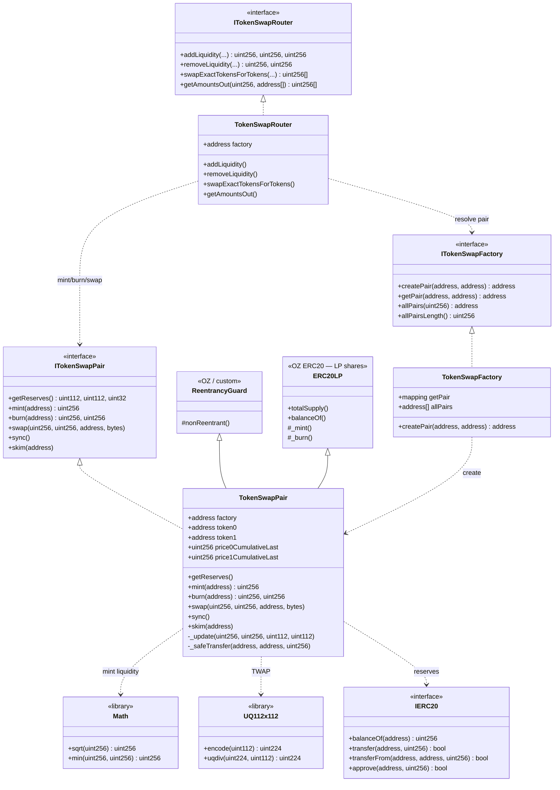
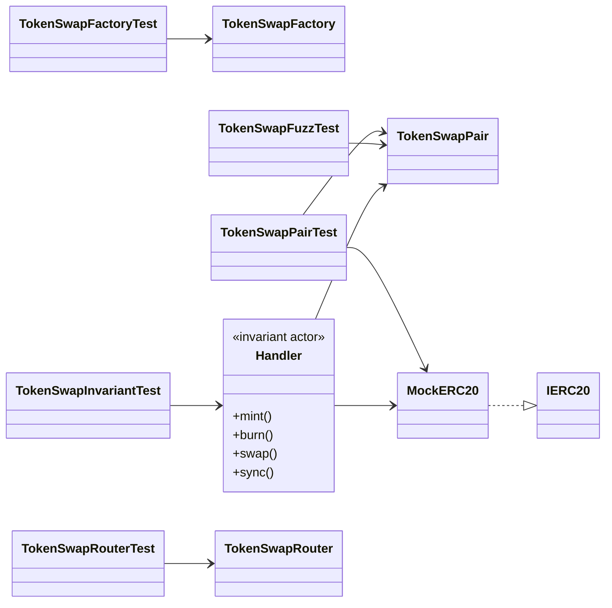
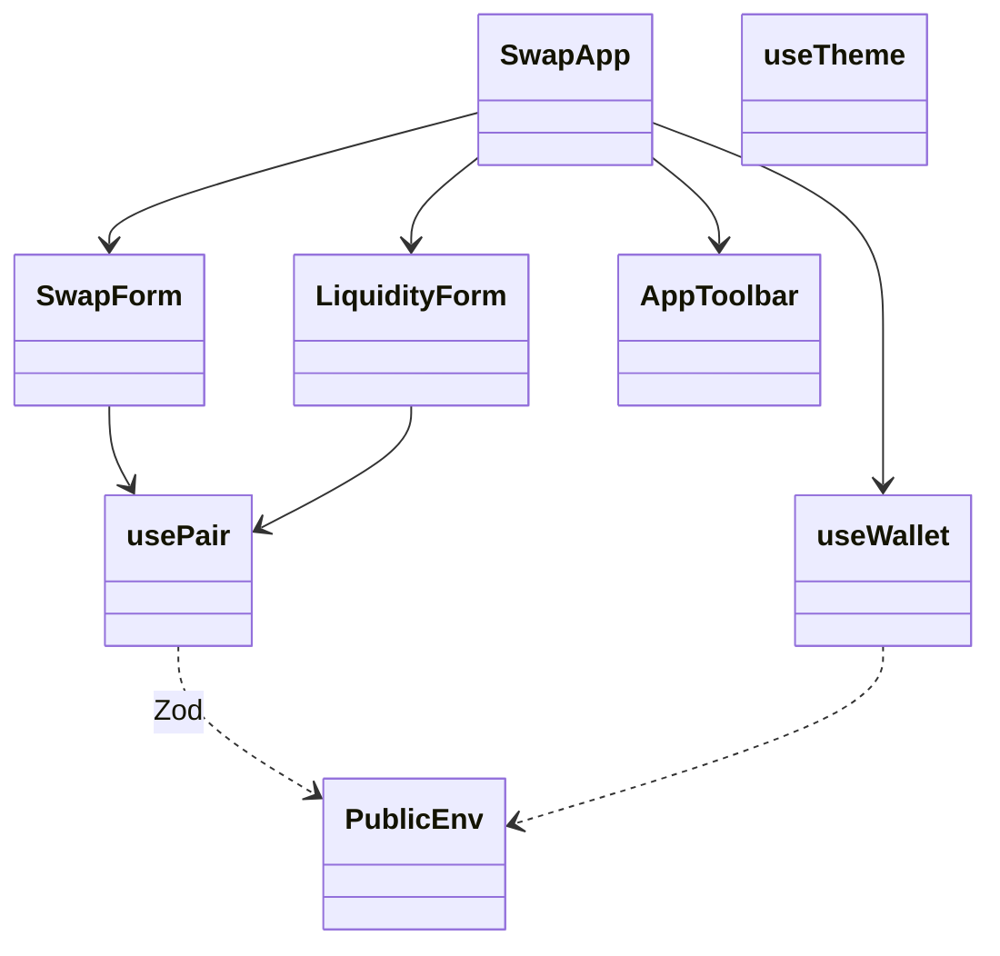

# Class diagram — Constant Product AMM (Token Swap)

🇪🇸 [Versión en español](./diagrama-clases-ES.md)

**To-be** structural model (module 06, planning). Contracts, libraries, tests and demo UI.

## 1. Main diagram (UML / Mermaid)



## 2. Tests and invariant handlers



## 3. Frontend (demo)



## 4. Responsibilities

| Artifact | Role |
|----------|------|
| `TokenSwapPair` | Reserves, swap (0.3%), LP mint/burn, TWAP `_update`, K-check |
| `TokenSwapFactory` | Create unique pairs; order `token0 < token1` |
| `TokenSwapRouter` | Slippage, deadlines, transferFrom UX |
| `Math` | `sqrt` for geometric liquidity |
| `UQ112x112` | Fixed-point price for TWAP accumulators |
| `ReentrancyGuard` | Lock on mint/swap/burn |
| `MockERC20` | Test tokens for Foundry / Anvil |
| `Handler` | Random actor for invariant testing |
| `SwapApp` | UI: swap + add/remove liquidity |

## 5. Dependencies (summary)

```
TokenSwapPair
  ├── inherits   → ERC20 (LP), ReentrancyGuard
  ├── implements → ITokenSwapPair
  ├── uses       → Math.sqrt, UQ112x112 (TWAP)
  ├── holds      → IERC20 token0/token1
  ├── emits      → Mint / Burn / Swap / Sync
  └── reverts    → Insufficient* / InvalidK / ZeroAddress

TokenSwapFactory
  ├── createPair → new TokenSwapPair (or CREATE2)
  └── getPair    → bidirectional mapping

TokenSwapRouter
  ├── factory    → resolve pair
  └── pair       → mint / burn / swap with minOut
```

## 6. Solidity layout (Pair)

1. Imports / interfaces / libraries  
2. Contract `TokenSwapPair`  
3. Immutables (`factory`, `token0`, `token1`)  
4. Packed reserves + TWAP state  
5. Events → Errors → Modifiers  
6. External: `getReserves`, `mint`, `burn`, `swap`, `skim`, `sync`  
7. Internal: `_update`, `_safeTransfer`
