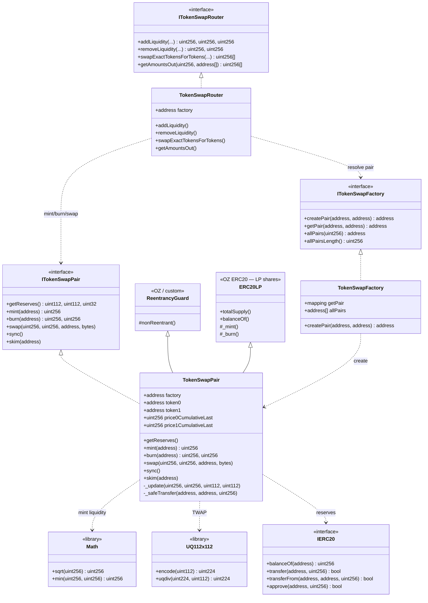
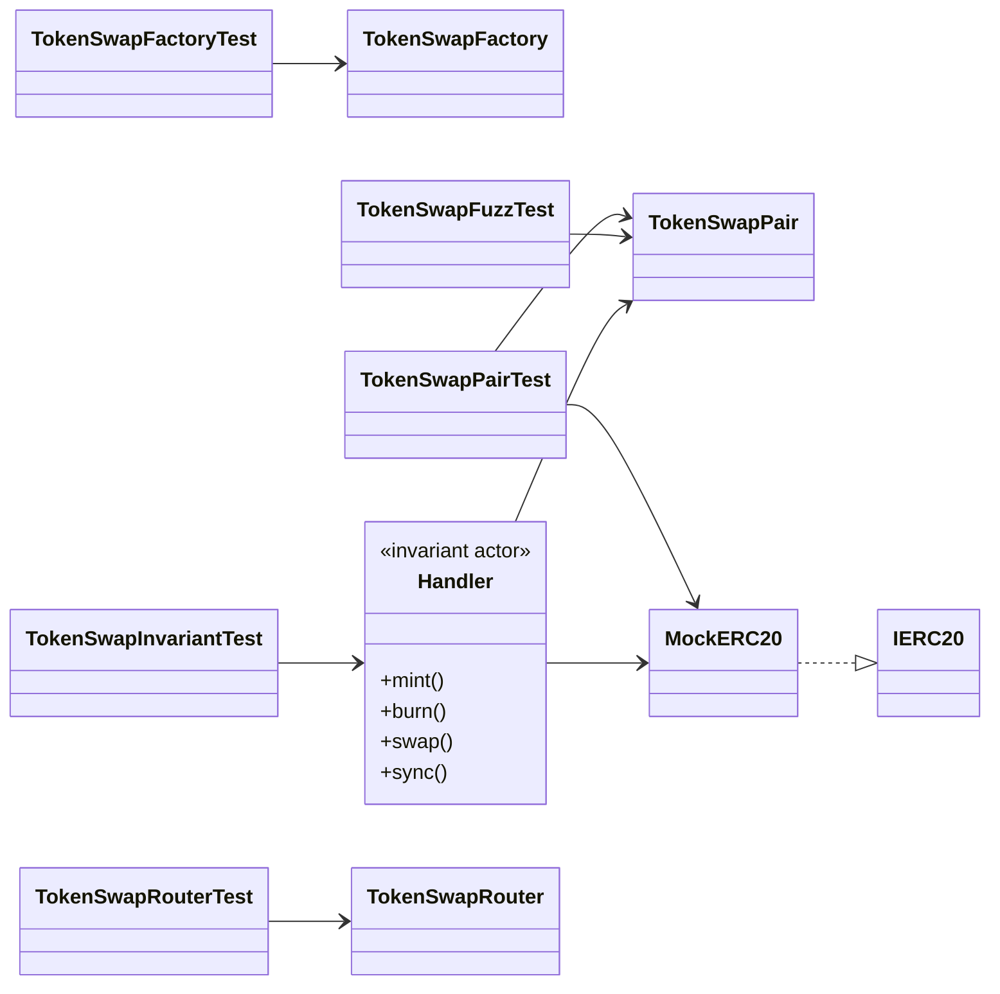
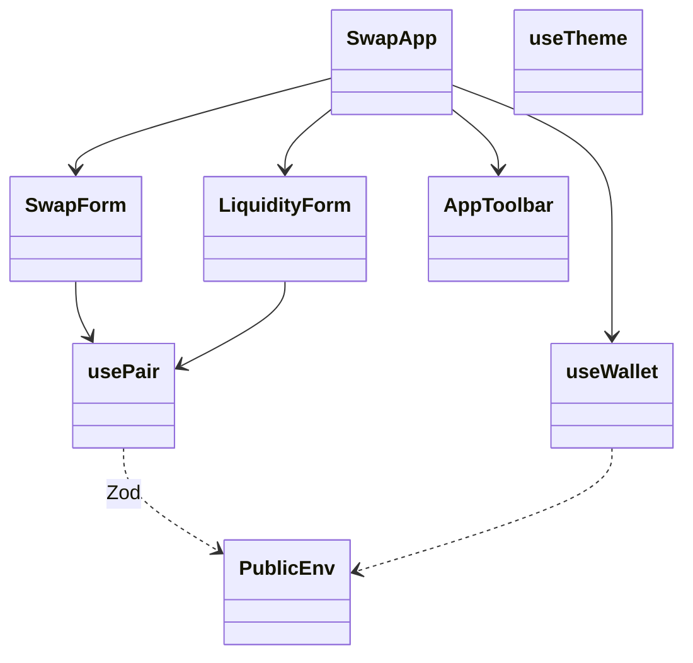

# Diagrama de clases — Constant Product AMM (Token Swap)

🇬🇧 [English version](./diagrama-clases-EN.md)

Modelo estructural **to-be** (módulo 06, planificación). Contratos, librerías, tests y demo UI.

## 1. Diagrama principal (UML / Mermaid)



## 2. Tests y handlers de invariantes



## 3. Frontend (demo)



## 4. Responsabilidades

| Artefacto | Rol |
|-----------|-----|
| `TokenSwapPair` | Reservas, swap (0.3%), mint/burn LP, TWAP `_update`, K-check |
| `TokenSwapFactory` | Crear pares únicos; orden `token0 < token1` |
| `TokenSwapRouter` | Slippage, deadlines, transferFrom UX |
| `Math` | `sqrt` para liquidez geométrica |
| `UQ112x112` | Precio fixed-point para acumuladores TWAP |
| `ReentrancyGuard` | Lock en mint/swap/burn |
| `MockERC20` | Tokens de prueba Foundry / Anvil |
| `Handler` | Actor aleatorio para invariant testing |
| `SwapApp` | UI: swap + add/remove liquidity |

## 5. Dependencias (resumen)

```
TokenSwapPair
  ├── hereda     → ERC20 (LP), ReentrancyGuard
  ├── implementa → ITokenSwapPair
  ├── usa        → Math.sqrt, UQ112x112 (TWAP)
  ├── custodia   → IERC20 token0/token1
  ├── emite      → Mint / Burn / Swap / Sync
  └── revierte   → Insufficient* / InvalidK / ZeroAddress

TokenSwapFactory
  ├── createPair → new TokenSwapPair (o CREATE2)
  └── getPair    → mapping bidireccional

TokenSwapRouter
  ├── factory    → resolve pair
  └── pair       → mint / burn / swap con minOut
```

## 6. Layout Solidity (Pair)

1. Imports / interfaces / libraries  
2. Contract `TokenSwapPair`  
3. Immutables (`factory`, `token0`, `token1`)  
4. Packed reserves + TWAP state  
5. Events → Errors → Modifiers  
6. External: `getReserves`, `mint`, `burn`, `swap`, `skim`, `sync`  
7. Internal: `_update`, `_safeTransfer`
