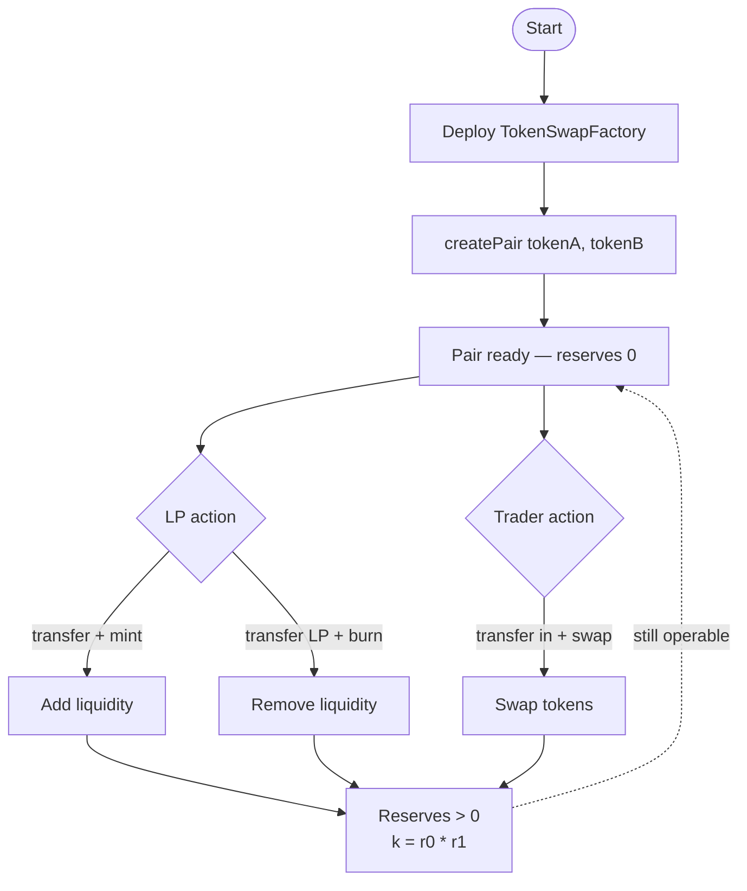
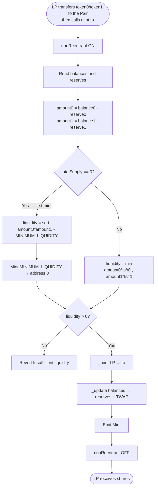
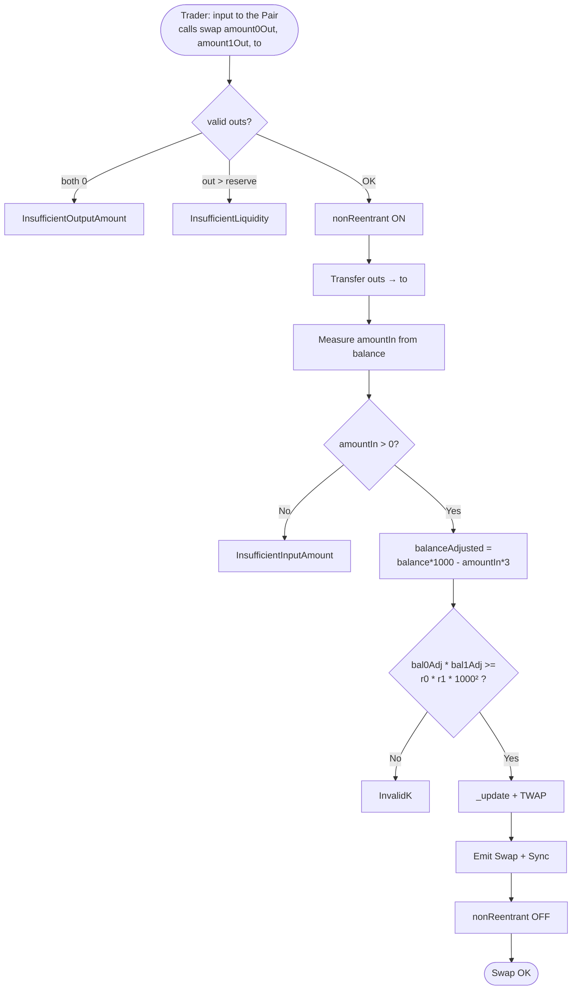
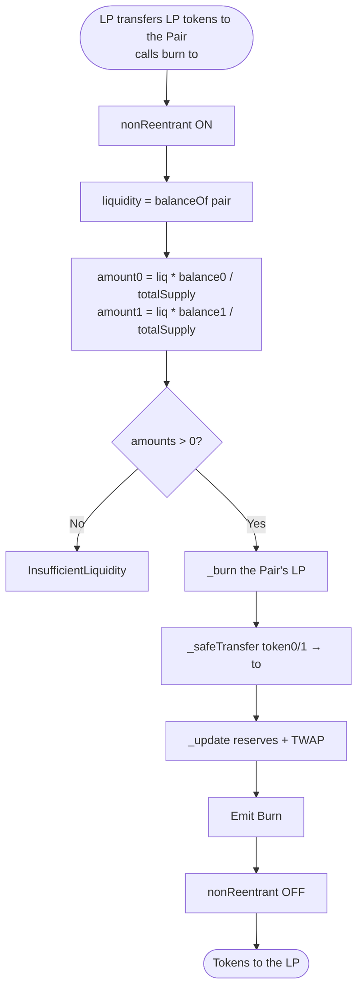
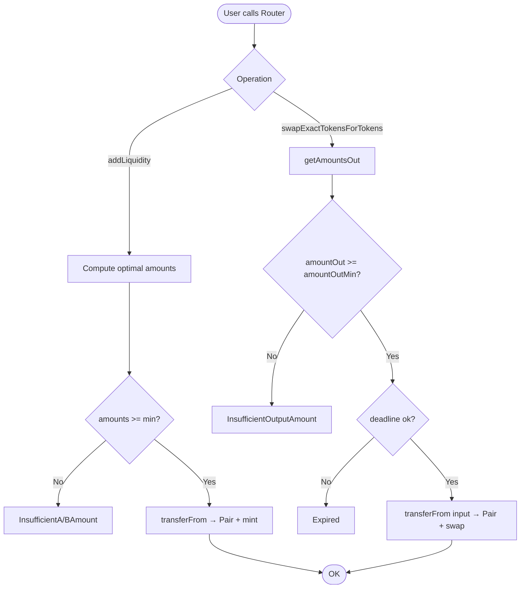
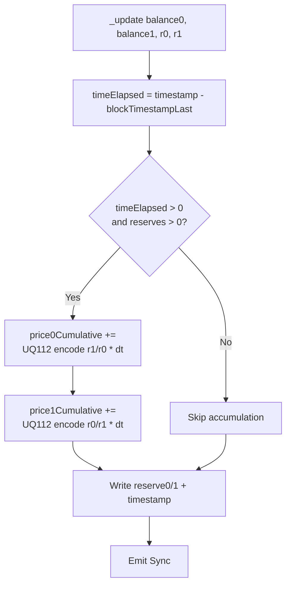

# Flow diagram — Constant Product AMM (Token Swap)

🇪🇸 [Versión en español](./diagrama-flujo-ES.md)

**To-be** business flows (v1). See also [flujograma-EN.md](./flujograma-EN.md) and [PLANIFICACION-EN.md](./PLANIFICACION-EN.md).

## 1. Pair lifecycle

## 2. Mint flow (first deposit vs subsequent)

## 3. Swap flow

## 4. Burn flow

## 5. Router flow (slippage)

## 6. TWAP update (`_update`)

## Legend

| Symbol | Meaning |
|--------|---------|
| Rectangle | Process / action |
| Diamond | Decision / validation |
| Oval | Start / end |
| Dashed arrow | Persistent pair state |
