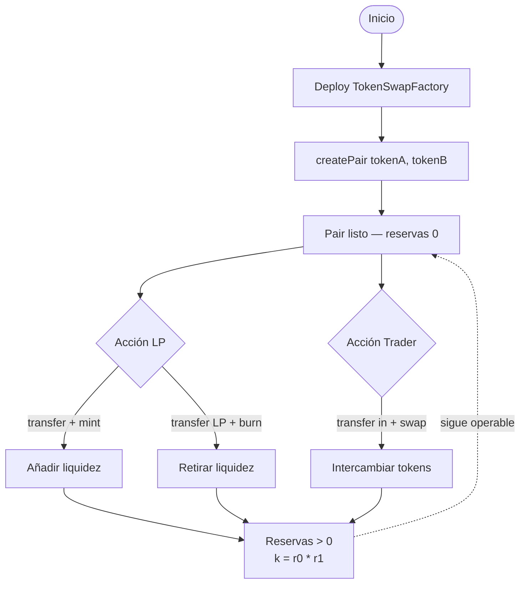
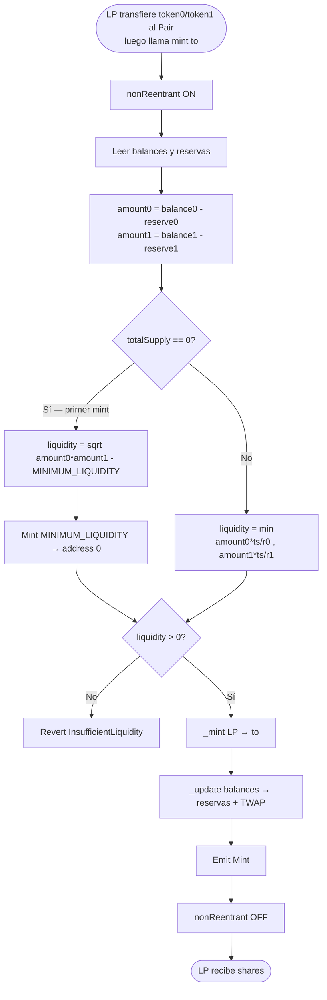
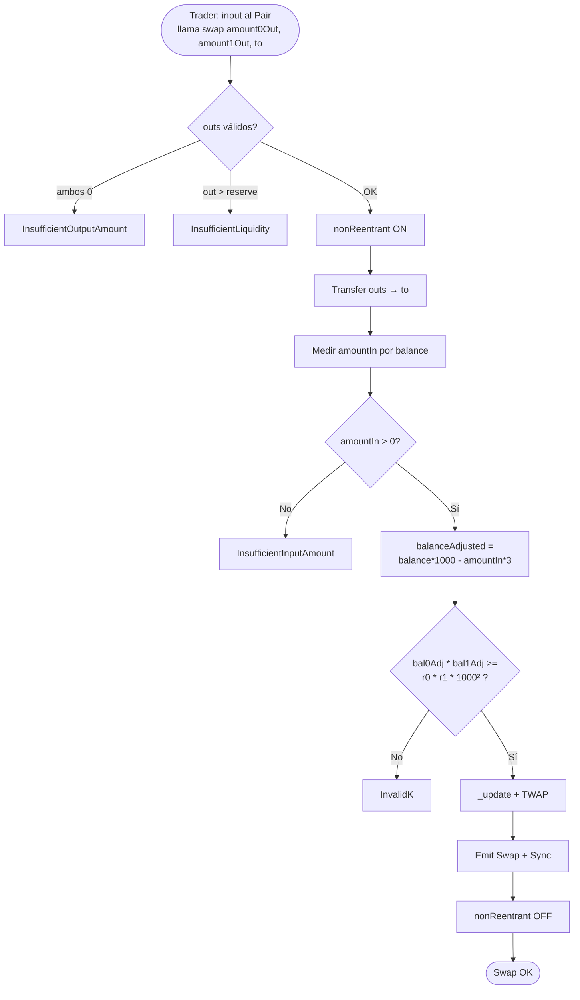
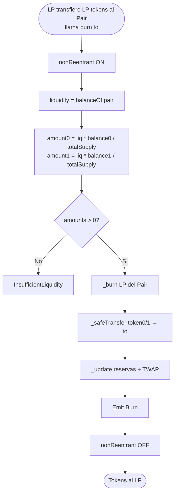
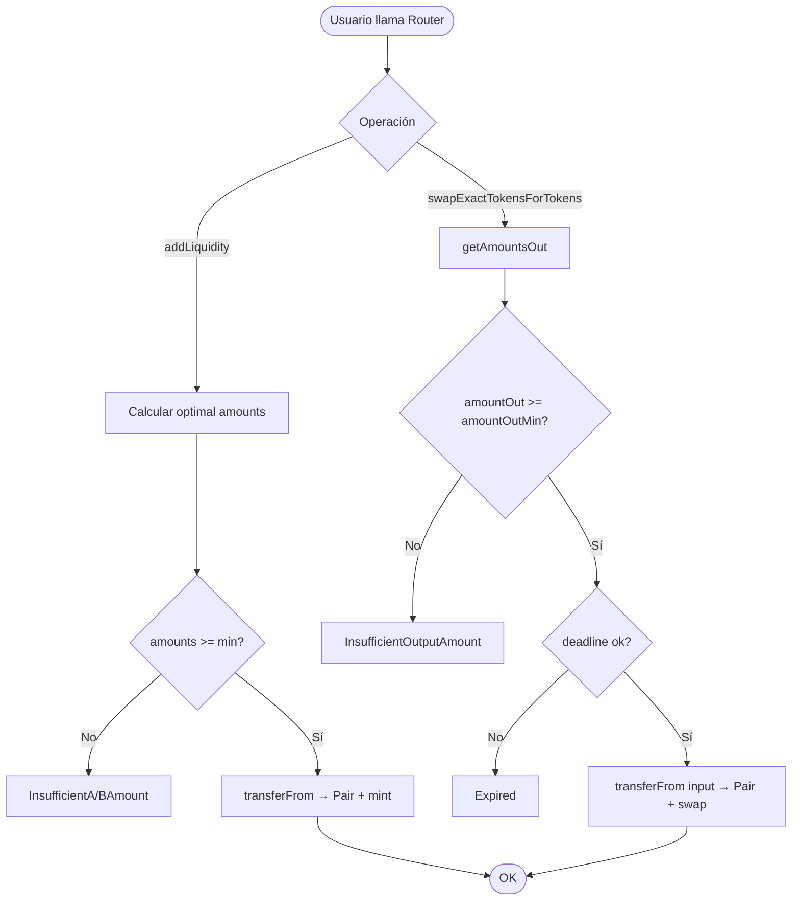
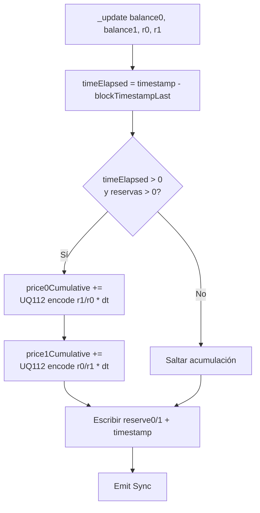

# Diagrama de flujo — Constant Product AMM (Token Swap)

🇬🇧 [English version](./diagrama-flujo-EN.md)

Flujos de negocio **to-be** (v1). Ver también [flujograma-ES.md](./flujograma-ES.md) y [PLANIFICACION-ES.md](./PLANIFICACION-ES.md).

## 1. Ciclo de vida del par

## 2. Flujo de mint (primer depósito vs subsequent)

## 3. Flujo de swap

## 4. Flujo de burn

## 5. Flujo Router (slippage)

## 6. Actualización TWAP (`_update`)

## Leyenda

| Símbolo | Significado |
|---------|-------------|
| Rectángulo | Proceso / acción |
| Diamante | Decisión / validación |
| Óvalo | Inicio / fin |
| Flecha punteada | Estado persistente del par |
