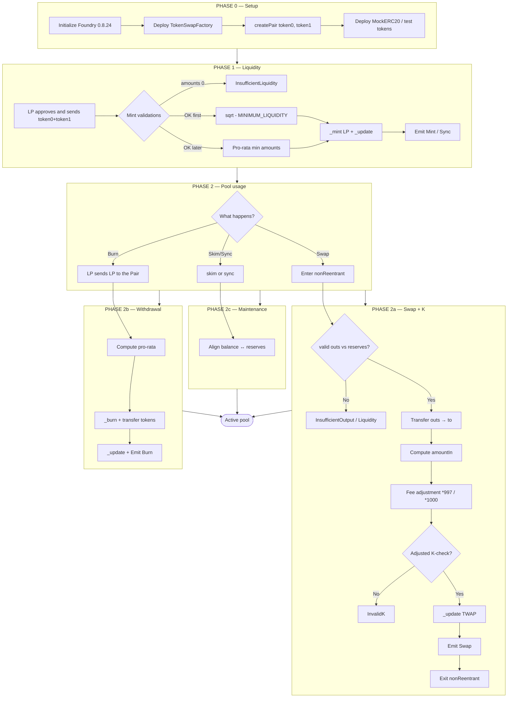
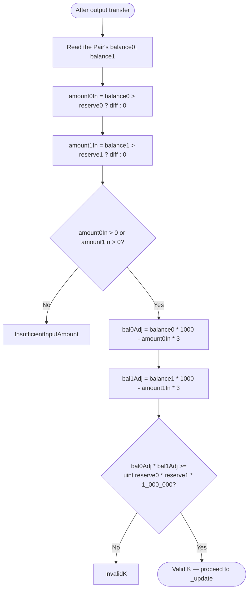
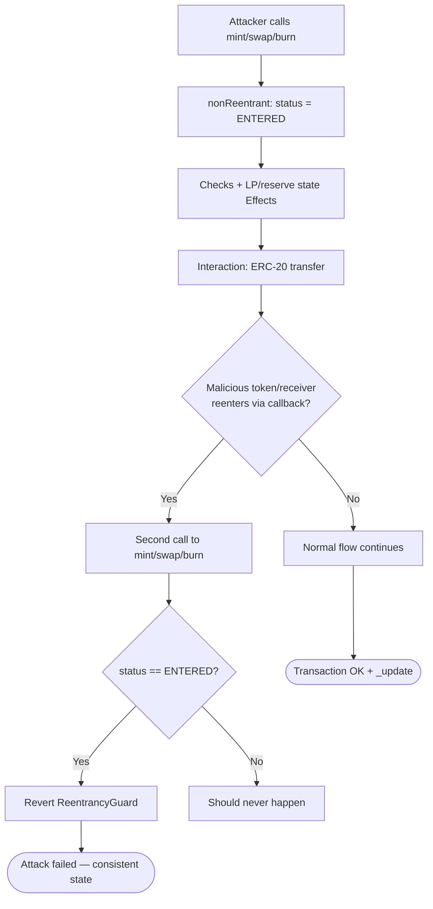
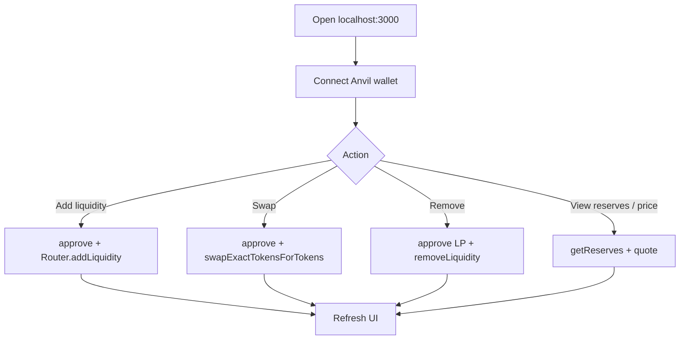

# Project flowchart — Constant Product AMM (Token Swap)

🇪🇸 [Versión en español](./flujograma-ES.md)

**To-be** operational flowchart (v1): setup → liquidity → swap/K-check → TWAP → security → UI.

## 1. Master system flowchart

## 2. Detailed K-check flowchart (0.3% fee)

## 3. Security flowchart (reentrancy)

## 4. Development pipeline flowchart (TDD)

```mermaid
flowchart LR
    A[.cursorrules] --> B[Planning docs]
    B --> C[Red .t.sol tests]
    C --> D[Math.sqrt + Pair skeleton]
    D --> E[mint + MINIMUM_LIQUIDITY]
    E --> F[swap + fee + InvalidK]
    F --> G[burn + skim/sync]
    G --> H[Factory + Router]
    H --> I[Invariant + Fuzz 1000]
    I --> J[Gas + NatSpec + SafeERC20]
    J --> K[Next.js demo]
    K --> L([Module closed])
```

## 5. Flow ↔ function ↔ invariant matrix

| Flowchart step | Function | Invariant |
|----------------|----------|-----------|
| Create pair | `Factory.createPair` | `token0 < token1`; a single pair |
| First mint | `mint` | `totalSupply = sqrt(a0*a1)`; 1000 LP locked |
| Subsequent mint | `mint` | shares ∝ pro-rata min |
| Pre-swap | `swap` | outs ≤ reserves; at least one out > 0 |
| Post-fee | `swap` | `balAdj0 * balAdj1 >= r0 * r1 * 1000²` |
| Post-swap | `_update` | `reserve0 * reserve1` reflects balances |
| TWAP | `_update` | cumulatives ↑ only if `timeElapsed > 0` |
| Burn | `burn` | tokens out ∝ LP burned |
| Invariant suite | Handler | `reserve0 * reserve1 >= k` throughout the sequence |
| Reentry | guard | second call reverts |

## 6. UI flow (demo)

## 7. How to read these diagrams

1. **Setup → Liquidity**: the pool starts empty; the first mint sets the implicit price.  
2. **Branch**: swap (with K-check), burn or maintenance.  
3. **K-check**: the 0.3% fee is embedded in the adjusted product `*1000` / `*3`.  
4. **TWAP / fuzz / UI**: module wrap-up (phases 0–8 + demo).
