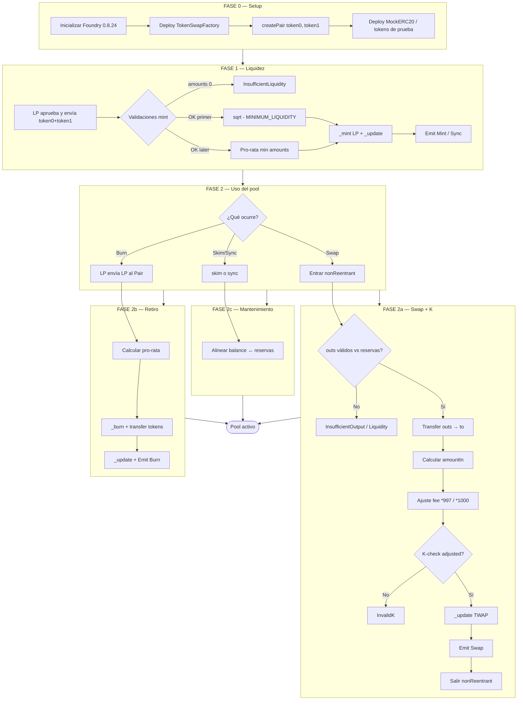
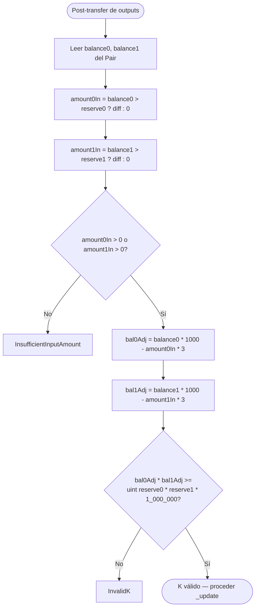
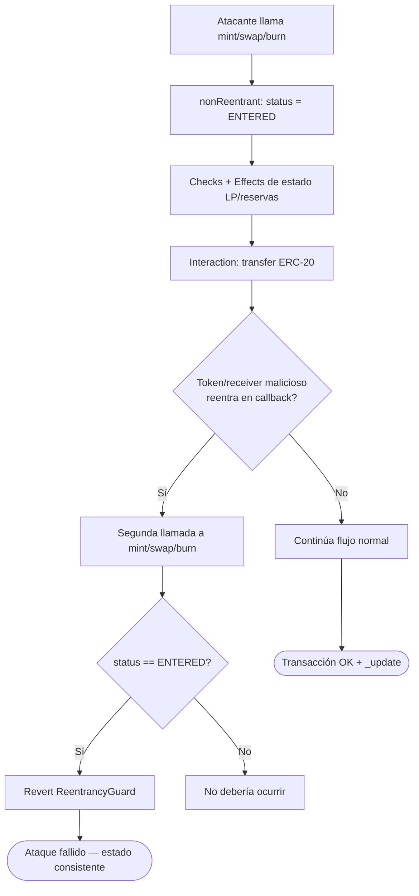
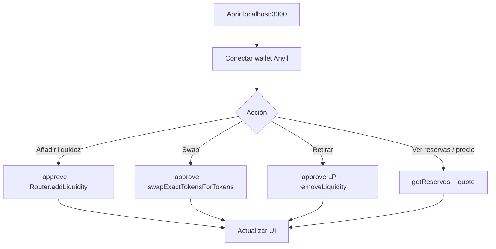

# Flujograma del proyecto — Constant Product AMM (Token Swap)

🇬🇧 [English version](./flujograma-EN.md)

Flujograma operativo **to-be** (v1): setup → liquidez → swap/K-check → TWAP → seguridad → UI.

## 1. Flujograma maestro del sistema

## 2. Flujograma detallado del K-check (fee 0.3%)

## 3. Flujograma de seguridad (reentrancy)

## 4. Flujograma del pipeline de desarrollo (TDD)

```mermaid
flowchart LR
    A[.cursorrules] --> B[Docs planificación]
    B --> C[Tests .t.sol rojos]
    C --> D[Math.sqrt + Pair skeleton]
    D --> E[mint + MINIMUM_LIQUIDITY]
    E --> F[swap + fee + InvalidK]
    F --> G[burn + skim/sync]
    G --> H[Factory + Router]
    H --> I[Invariant + Fuzz 1000]
    I --> J[Gas + NatSpec + SafeERC20]
    J --> K[Demo Next.js]
    K --> L([Módulo cerrado])
```

## 5. Matriz flujo ↔ función ↔ invariante

| Paso del flujograma | Función | Invariante |
|---------------------|---------|------------|
| Crear par | `Factory.createPair` | `token0 < token1`; un solo pair |
| Primer mint | `mint` | `totalSupply = sqrt(a0*a1)`; 1000 LP locked |
| Mint posterior | `mint` | shares ∝ min pro-rata |
| Pre-swap | `swap` | outs ≤ reservas; al menos un out > 0 |
| Post-fee | `swap` | `balAdj0 * balAdj1 >= r0 * r1 * 1000²` |
| Post-swap | `_update` | `reserve0 * reserve1` refleja balances |
| TWAP | `_update` | cumulatives ↑ solo si `timeElapsed > 0` |
| Burn | `burn` | tokens out ∝ LP quemados |
| Invariant suite | Handler | `reserve0 * reserve1 >= k` a lo largo de la secuencia |
| Reentrada | guard | segunda llamada revierte |

## 6. Flujo UI (demo)

## 7. Cómo leer estos diagramas

1. **Setup → Liquidez**: el pool nace vacío; el primer mint fija el precio implícito.  
2. **Branch**: swap (con K-check), burn o mantenimiento.  
3. **K-check**: el fee 0.3% está embebido en el producto ajustado `*1000` / `*3`.  
4. **TWAP / fuzz / UI**: cierre del módulo (fases 0–8 + demo).
